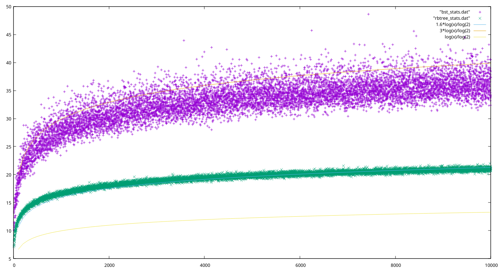

# Red-Black Tree vs BST Comparison

Results of a comparison between a Red-Black Tree and a regular Binary Search
Tree in terms of average tree height. The results have been plotted over a range
of nodes from 10 to 10,000. Even with this moderately small sample size, a clear
pattern emerges.



## Try it out

Generate data for regular BST.
```sh
gcc bst.c -o bst
./bst
```
The file bst_stats.dat is created. The first column represents node count and
the second represents avg. height of the tree averaged over 10 trees.

Generate data for regular BST.
```sh
gcc rbtree.c -o rbtree
./rbtree
```
Here, the file rbtree_stats.dat is created.

Plot the data using gnuplot
```
gnuplot
> plot "bst_stats.dat", "rbtree_stats.dat"
```
